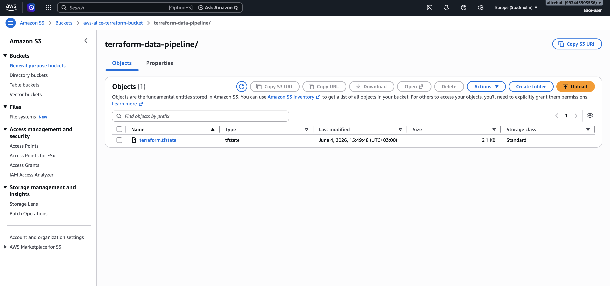
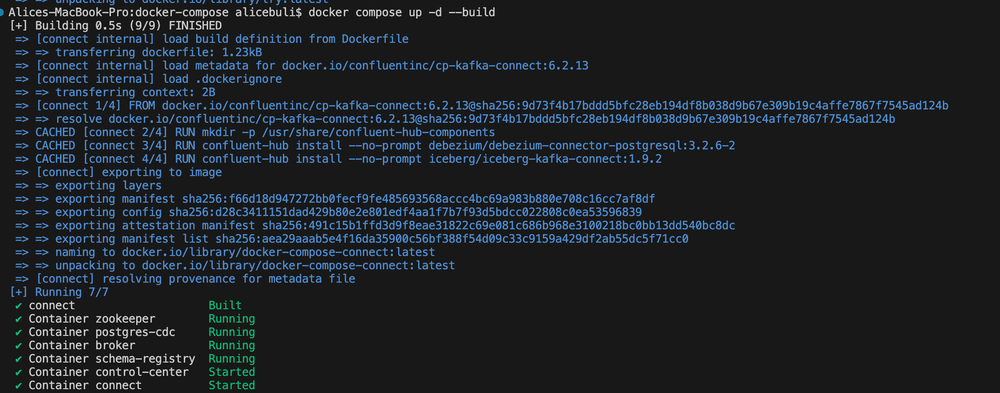
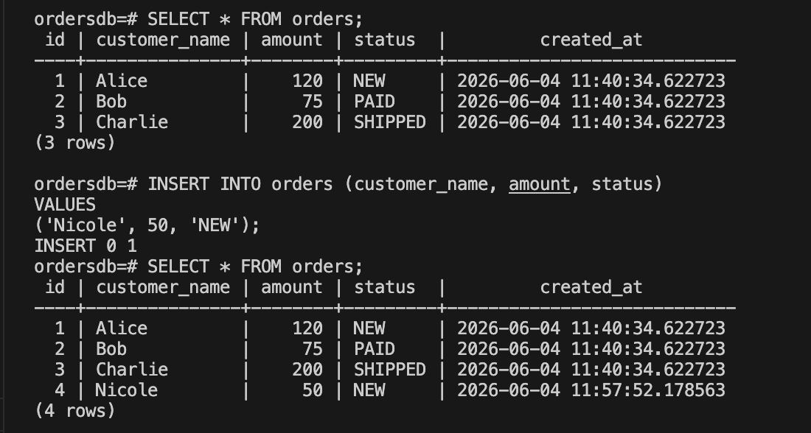
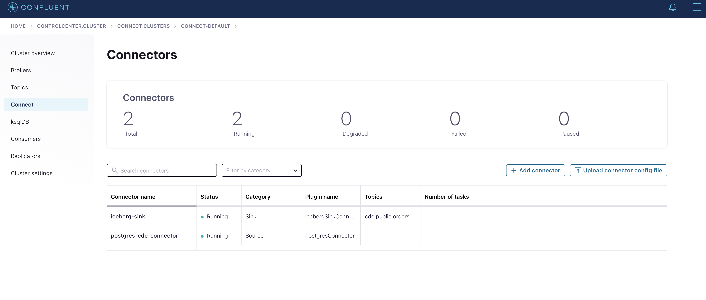
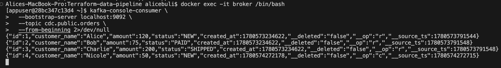
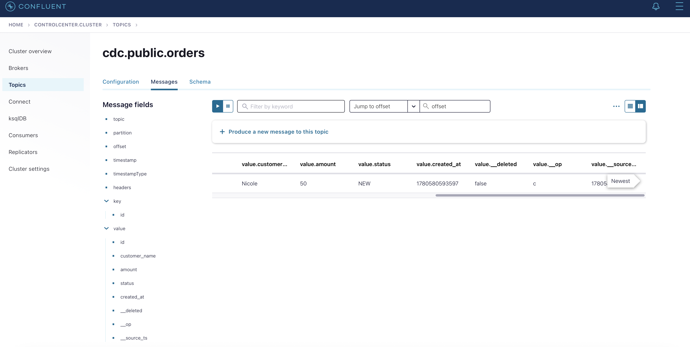
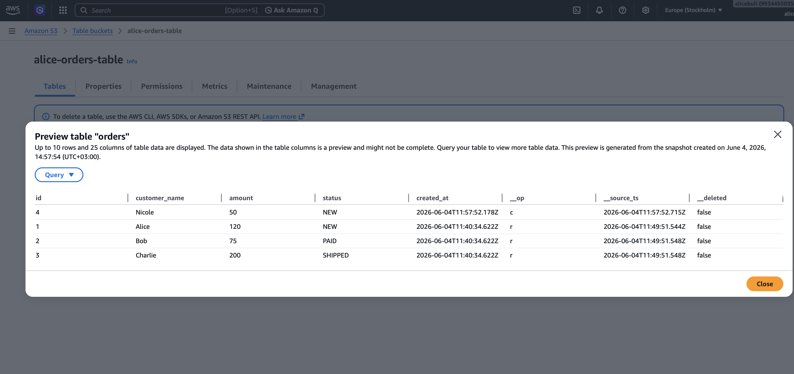

# Terraform-data-pipeline


## Overview

This project implements an end-to-end Change Data Capture (CDC) data pipeline:

```text
PostgreSQL Database (CDC)
        ↓
Confluent Platform (Kafka)
        ↓
S3 Tables (Iceberg)
```

The pipeline captures changes from a PostgreSQL database using Debezium, streams them through Apache Kafka, and stores them in AWS S3 Tables using the Apache Iceberg format.

The solution combines AWS infrastructure provisioned with Terraform and containerized services deployed using Docker Compose.

## Repository Structure

The project is divided into four repositories, each responsible for a specific part of the platform.

### 1. Terraform Repository

This repository contains the Infrastructure as Code (IaC) implementation used to provision AWS resources.

#### Modules

##### IAM Module

Creates and manages IAM resources required by the project, including:

* IAM policies
* Policy attachments for the deployment user
* Permissions required to provision and manage AWS resources

##### S3 Tables Module

Creates the AWS S3 Tables infrastructure, including:

* S3 Table Bucket
* Namespace
* Iceberg Table

The Iceberg table is used as the final destination for CDC events produced by the pipeline.

### 2. Docker Compose Repository

This repository contains the local services required for the CDC pipeline.

#### PostgreSQL

A PostgreSQL container is deployed using Docker Compose.

An `init.sql` script is executed automatically during container initialization to:

- Create the `orders` table and insert sample data 
- Prepare the database for CDC by setting wal_level=logical

CDC is enabled using PostgreSQL logical replication.

#### Confluent Platform

Deploying the following Confluent components using Docker Compose:

- Kafka Broker
- Kafka Connect
- Schema Registry
- Control Center

A custom Kafka Connect image is built using a Dockerfile.

The image includes:

- Debezium PostgreSQL Connector
- Iceberg Sink Connector

AWS credentials are provided to the Kafka Connect container through a `.env` file, allowing the Iceberg connector to access AWS S3 Tables.

### 3. Connector Configuration Repository

This repository contains the Kafka Connect connector definitions used by the pipeline.

#### Debezium PostgreSQL Source Connector

The source connector:

- Connects to PostgreSQL
- Captures CDC events using logical replication
- Publishes change events to topics

#### Iceberg Sink Connector

The sink connector:

- Consumes CDC events from Kafka
- Maps records to an Iceberg table
- Writes data directly into AWS S3 Tables

### 4. Scripts Repository

This repository contains deployment and initialization scripts used to automate the Kafka setup.

#### create-topic.sh

Creates the Kafka topic used by the CDC pipeline, in this case its cdc.public.orders


#### create-connectors.sh

Registers the Kafka Connect connectors using the configuration files stored in the connector repository.

The script creates:
- Debezium PostgreSQL Source Connector
- Iceberg Sink Connector

This allows the entire pipeline to be initialized automatically after the infrastructure and containers are running.


## Prerequisites

Before starting the deployment, ensure the following tools are installed and configured:

- Docker
- Docker Compose
- Terraform
- AWS CLI
- Git
- Bash shell (Linux/macOS) or a compatible shell environment
- An AWS account with permissions to create S3 Tables resources


## Setup Instructions

## Setup Instructions

1. cd into the terraform repo  
2. in the root main.tf change the bucket_name according to the bucket you wanted to use for the remote state of terraform
3. run terraform init  
4. run terraform apply

5. cd into the docker-compose repo  
6. create a .env file based on the .env-sample provided  
7. run docker compose up -d --build to start the full stack  

8. verify all containers are running (postgres, kafka broker, kafka connect, schema registry, control center)  
9. cd into the scripts repo  
10. use chmod +x to give execution permissions to the scripts  
11. run the create-topic.sh script to create the topic  
12. edit the iceberg connector property iceberg.catalog.warehouse to the bucket that terraform created arn run the create-connectors.sh script to register Debezium and Iceberg connectors  

13. verify PostgreSQL is running and the orders table exists  
14. insert a test record into the orders table  
15. verify the postgres connector works by checking is record appears in the Kafka topic cdc.public.orders or in the control plane ui.
16. verify the Iceberg sink connector is running without errors  
17. verify data is written into the S3 Tables Iceberg table  
18. verify pipeline activity in Confluent Control Center


## Debug/check flow:
check if after the terraform apply the terraform.tfstate is in the s3 bucket you set in the backend.tf:



after running the docker compose you should see:



to debug postgres:
```text
docker exec -it postgres-cdc psql -U postgres -d ordersdb

SELECT * FROM orders;

INSERT INTO orders (customer_name, amount, status)
VALUES
('Nicole', 50, 'NEW');
```
in the conteiner:



to check connectors are up check in the control plane (http://localhost:9092)
it should look like:



if a connector is failed check here:
```text
http://localhost:8083/connectors/<connector-name>/status
http://localhost:8083/connectors/<connector-name>/config
```

after that check if the broker gets the messages from the postgres db,
you can check with CLI:
```text
docker exec -it broker /bin/bash

kafka-console-consumer \
  --bootstrap-server localhost:9092 \
  --topic cdc.public.orders \
  --from-beginning 2>/dev/null
```


you can also check in the control-plane:



and then check if it gets to your s3, it should look like:





